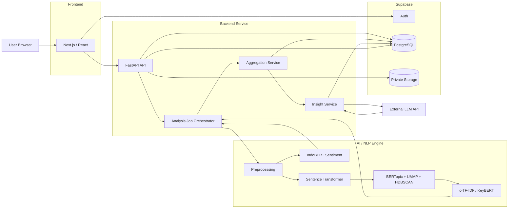
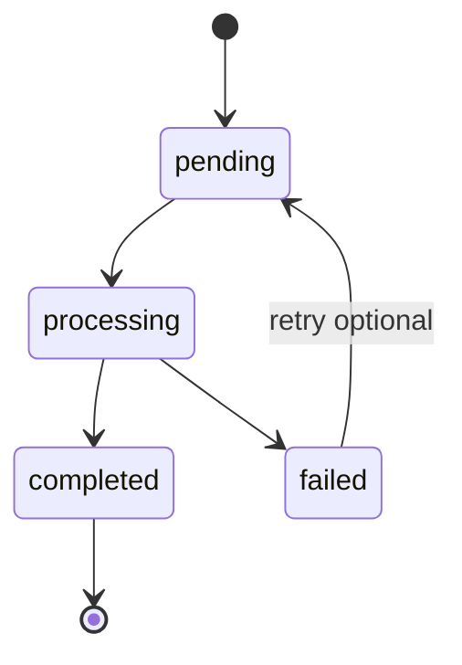
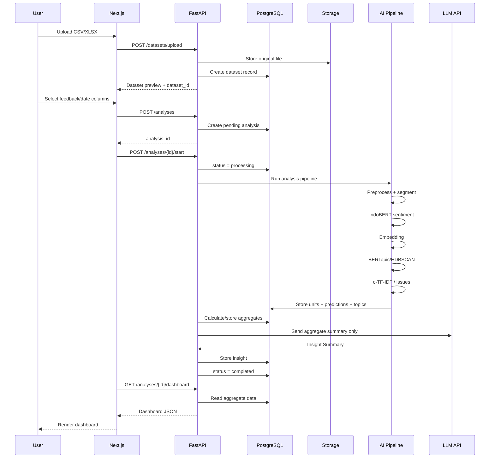
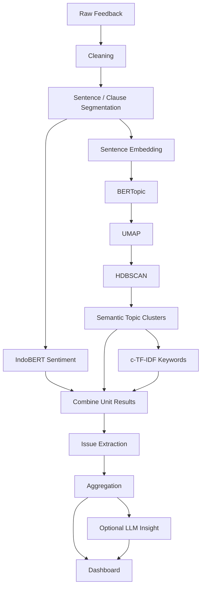
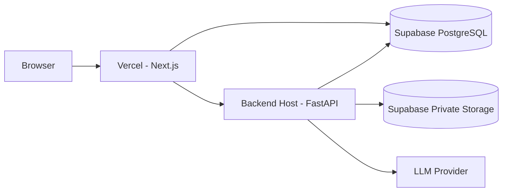

# SVARA AI System Architecture

**Document:** System Architecture  
**Product:** SVARA AI  
**Version:** 1.0  
**Status:** Development Baseline  
**Last Updated:** 24 August 2026  

---

## 1. Architecture Goals

Arsitektur SVARA AI dirancang untuk memenuhi kebutuhan berikut:

1. Memisahkan frontend, backend, AI pipeline, dan data storage dengan ownership yang jelas.
2. Memungkinkan development dilakukan secara paralel oleh empat role.
3. Menjaga AI core tidak bergantung pada LLM.
4. Membuat proses analysis dapat berjalan sebagai job karena inference dapat membutuhkan waktu.
5. Memudahkan penggantian model sentiment, embedding model, atau LLM tanpa mengubah keseluruhan aplikasi.
6. Menjaga dataset user tetap private.
7. Memungkinkan frontend dan backend dikembangkan menggunakan mock contract sebelum AI selesai.

---

## 2. Technology Stack

| Layer | Technology |
|---|---|
| Frontend | Next.js, React, Tailwind CSS |
| Visualization | Recharts atau library chart setara |
| Backend API | FastAPI, Python |
| Data Processing | Pandas |
| Validation | Pydantic |
| Sentiment | Hugging Face Transformers, IndoBERT |
| Embedding | Sentence Transformers |
| Topic Discovery | BERTopic, UMAP, HDBSCAN |
| Topic Representation | c-TF-IDF |
| Issue Extraction | c-TF-IDF, KeyBERT optional |
| LLM | External API, hanya Insight Summary |
| Database | PostgreSQL via Supabase |
| Authentication | Supabase Auth |
| File Storage | Supabase Storage |
| Frontend Hosting | Vercel atau equivalent |
| Backend Hosting | Render, Railway, VM, atau equivalent |

---

## 3. High-Level Architecture



---

## 4. Core Architecture Principle

SVARA AI menggunakan prinsip berikut:

```text
Deterministic Core Analysis
          +
Optional Generative Explanation
```

Core analysis:

```text
IndoBERT
BERTopic
HDBSCAN
c-TF-IDF
Backend Aggregation
```

Generative layer:

```text
LLM Insight Summary
```

Jika LLM gagal, status analysis tetap dapat menjadi `completed` selama core analysis berhasil.

---

## 5. System Context

### Actor

**Authenticated User**

Kemampuan utama:

- upload dataset,
- preview dataset,
- memilih kolom,
- menjalankan analysis,
- melihat status,
- membaca dashboard,
- membuka analysis history.

### External Services

#### Supabase

Digunakan untuk:

- authentication,
- relational database,
- private file storage.

#### External LLM Provider

Digunakan hanya untuk:

- menghasilkan Insight Summary dari statistik agregat.

---

## 6. Frontend Architecture

Frontend menggunakan Next.js.

Suggested route:

```text
/
├── /login
├── /dashboard
├── /analyses
│   ├── /new
│   └── /[analysisId]
└── /settings
```

### Main UI Modules

```text
components/
├── upload/
│   ├── FileDropzone
│   ├── DatasetPreview
│   └── ColumnMapper
│
├── analysis/
│   ├── AnalysisProgress
│   ├── AnalysisStatus
│   └── AnalysisHeader
│
└── dashboard/
    ├── OverviewCards
    ├── OverallSentimentChart
    ├── SentimentTrendChart
    ├── TopicClusterTable
    ├── TopicSentimentChart
    ├── TopIssues
    └── InsightSummary
```

### Frontend State

Minimal state:

- authenticated user,
- selected file,
- preview data,
- selected feedback column,
- selected date column,
- current analysis ID,
- analysis status,
- dashboard result.

### Polling

Setelah `Start Analysis`, frontend melakukan polling:

```text
GET /analyses/{analysis_id}/status
```

hingga status:

```text
completed
failed
```

Recommended MVP polling interval:

```text
2 to 5 seconds
```

---

## 7. Backend Architecture

Suggested project structure:

```text
backend/
├── app/
│   ├── main.py
│   │
│   ├── api/
│   │   ├── auth.py
│   │   ├── datasets.py
│   │   ├── analyses.py
│   │   └── dashboard.py
│   │
│   ├── core/
│   │   ├── config.py
│   │   ├── security.py
│   │   └── logging.py
│   │
│   ├── schemas/
│   │   ├── dataset.py
│   │   ├── analysis.py
│   │   └── dashboard.py
│   │
│   ├── services/
│   │   ├── file_service.py
│   │   ├── preprocessing_service.py
│   │   ├── analysis_service.py
│   │   ├── aggregation_service.py
│   │   └── insight_service.py
│   │
│   ├── ai/
│   │   ├── sentiment.py
│   │   ├── embeddings.py
│   │   ├── topic_model.py
│   │   └── keyword_extraction.py
│   │
│   ├── repositories/
│   │   ├── dataset_repository.py
│   │   ├── analysis_repository.py
│   │   └── result_repository.py
│   │
│   └── workers/
│       └── analysis_worker.py
│
├── tests/
└── requirements.txt
```

---

## 8. Backend Responsibilities

### API Layer

Bertanggung jawab terhadap:

- authentication context,
- request validation,
- response schema,
- API error handling.

### Service Layer

Bertanggung jawab terhadap:

- business logic,
- file processing,
- analysis orchestration,
- aggregation,
- insight generation.

### Repository Layer

Bertanggung jawab terhadap:

- database queries,
- persistence,
- ownership check.

### AI Layer

Bertanggung jawab terhadap:

- model loading,
- inference,
- topic discovery,
- keyword extraction.

AI layer tidak boleh mengetahui struktur frontend.

---

## 9. Analysis Job Lifecycle



### `pending`

Analysis sudah dibuat tetapi worker belum memulai.

### `processing`

Pipeline AI sedang berjalan.

### `completed`

Core analysis berhasil disimpan.

Insight Summary boleh `null` apabila LLM gagal.

### `failed`

Core pipeline gagal.

Field `error_message` disimpan untuk debugging.

---

## 10. End-to-End Processing Sequence



---

## 11. Detailed AI Pipeline



---

## 12. Sentence and Clause Strategy

Problem:

```text
"Makanannya enak tetapi pelayanannya lambat."
```

Whole-review sentiment dapat kehilangan mixed opinion.

SVARA AI memproses unit yang lebih kecil:

```text
"Makanannya enak"
→ Positive
→ topic: makanan / rasa / menu

"pelayanannya lambat"
→ Negative
→ topic: pelayanan / lambat / ramah
```

MVP dapat menggunakan:

1. sentence splitting terlebih dahulu,
2. clause splitting untuk pola sederhana jika dibutuhkan.

Clause splitting kompleks bukan requirement wajib apabila waktunya terbatas.

---

## 13. Sentiment Model Interface

Internal Python interface:

```python
class SentimentResult:
    label: str
    confidence: float
    probabilities: dict[str, float]
```

Example:

```json
{
  "label": "negative",
  "confidence": 0.943,
  "probabilities": {
    "positive": 0.021,
    "neutral": 0.036,
    "negative": 0.943
  }
}
```

Model version harus tercatat pada analysis.

---

## 14. Topic Model Interface

Output topic discovery:

```json
{
  "topic_id": 3,
  "keywords": [
    {"keyword": "otp", "weight": 0.182},
    {"keyword": "login", "weight": 0.164},
    {"keyword": "verifikasi", "weight": 0.139}
  ]
}
```

Dashboard label:

```text
OTP / Login / Verifikasi
```

Tidak ada LLM naming.

---

## 15. LLM Boundary

LLM hanya menerima hasil agregat.

### Allowed

```text
Total feedback
Sentiment percentage
Top topic keywords
Topic sentiment distribution
Top issues
Trend summary
```

### Not Allowed by Design

```text
Full uploaded file
All raw feedback
Model training data
Authentication data
Sensitive user profile data
```

### Failure Behavior

Jika request LLM gagal:

```text
analysis.status = completed
insight.status = failed
dashboard = available
```

---

## 16. Aggregation Service

Aggregation service mengubah prediction individual menjadi dashboard statistics.

Contoh:

```text
Predictions
↓
count by sentiment
↓
percentage
↓
group by topic
↓
topic sentiment distribution
↓
trend grouping
↓
issue ranking
```

Backend yang melakukan perhitungan ini. Bukan LLM.

---

## 17. Suggested API Contract

Base prefix:

```text
/api/v1
```

Kontrak runtime yang dapat divalidasi disimpan di [`docs/SVARA_AI_API_CONTRACT.md`](SVARA_AI_API_CONTRACT.md), sedangkan bentuk output AI kanonik disimpan di [`docs/SVARA_AI_AI_CONTRACT.md`](SVARA_AI_AI_CONTRACT.md) dan [`contracts/ai-result.schema.json`](../contracts/ai-result.schema.json).

### Dataset

#### `POST /datasets/upload`

Input:

```text
multipart/form-data
file
```

Output:

```json
{
  "dataset_id": "uuid",
  "filename": "reviews.csv",
  "row_count": 5000,
  "columns": [
    "review",
    "date"
  ],
  "preview": [
    {
      "review": "OTP tidak masuk",
      "date": "2026-08-01"
    }
  ]
}
```

---

### Analysis

#### `POST /analyses`

Input:

```json
{
  "dataset_id": "uuid",
  "name": "Review Agustus",
  "feedback_column": "review",
  "date_column": "date"
}
```

Output:

```json
{
  "analysis_id": "uuid",
  "status": "pending"
}
```

---

#### `POST /analyses/{analysis_id}/start`

Output:

```json
{
  "analysis_id": "uuid",
  "status": "processing"
}
```

---

#### `GET /analyses/{analysis_id}/status`

Output:

```json
{
  "analysis_id": "uuid",
  "status": "processing",
  "progress": 55,
  "stage": "topic_discovery"
}
```

Progress percentage bersifat optional pada MVP. Minimal status dan stage tersedia.

---

#### `GET /analyses/{analysis_id}/dashboard`

Example:

```json
{
  "analysis": {
    "id": "uuid",
    "name": "Review Agustus",
    "status": "completed"
  },
  "overview": {
    "total_feedback": 5000,
    "positive": 52.0,
    "neutral": 17.0,
    "negative": 31.0
  },
  "topics": [
    {
      "topic_id": 3,
      "label": "OTP / Login / Verifikasi",
      "size": 730,
      "sentiment": {
        "positive": 12.0,
        "neutral": 17.0,
        "negative": 71.0
      }
    }
  ],
  "top_issues": [
    {
      "text": "otp tidak masuk",
      "frequency": 256,
      "topic_id": 3
    }
  ],
  "trend": [],
  "insight": {
    "status": "completed",
    "summary": "Keluhan terbesar berada pada proses login dan verifikasi."
  }
}
```

---

#### `GET /analyses`

Mengembalikan analysis history milik authenticated user.

---

## 18. Data Persistence Strategy

### Original Dataset

Stored in:

```text
Supabase Storage
private bucket
```

Database hanya menyimpan:

- storage path,
- filename,
- metadata.

### Parsed Feedback

Disimpan di PostgreSQL untuk:

- traceability,
- analysis details,
- reproducibility.

### Predictions

Sentiment dan topic assignment disimpan per analysis unit.

### Aggregates

Dashboard statistics disimpan sebagai cache atau JSONB untuk mempercepat load dashboard.

---

## 19. Background Processing

Analysis dapat membutuhkan waktu lebih lama daripada request HTTP biasa.

### MVP

Gunakan:

```text
FastAPI BackgroundTasks
atau
worker process sederhana
```

dengan job status di PostgreSQL.

### Production Evolution

Jika kebutuhan meningkat:

```text
FastAPI
  ↓
Redis Queue
  ↓
Celery / RQ Worker
```

Tidak wajib untuk MVP.

---

## 20. Parallel Development Contract

Empat role dapat bekerja paralel dengan contract berikut.

### AI Contract

AI menghasilkan:

```json
{
  "unit_id": "uuid",
  "sentiment": "negative",
  "confidence": 0.94,
  "topic_id": 3,
  "keywords": [
    "otp",
    "login",
    "verifikasi"
  ]
}
```

### Backend Contract

Backend menghasilkan dashboard JSON yang stabil.

### Frontend Contract

Frontend hanya bergantung pada response schema, bukan implementasi AI.

### QA Contract

QA memiliki:

- API contract,
- acceptance criteria,
- fixture/mock data.

---

## 21. Deployment Architecture



### Important

Frontend tidak boleh memanggil LLM API secara langsung.

LLM API key hanya tersedia pada backend environment.

---

## 22. Security Architecture

### Authentication

Supabase Auth JWT.

### Authorization

Setiap endpoint harus memastikan:

```text
analysis.user_id == current_user.id
```

### Storage

Original datasets berada pada private bucket.

### Database

Gunakan Row Level Security jika frontend mengakses Supabase secara langsung.

### Secrets

Disimpan pada environment variables:

```text
SUPABASE_URL
SUPABASE_SERVICE_KEY
LLM_API_KEY
MODEL_CONFIG
```

Service key tidak pernah dikirim ke browser.

---

## 23. Observability

Minimum MVP logging:

- upload success/failure,
- analysis start,
- preprocessing completion,
- sentiment completion,
- topic completion,
- aggregation completion,
- LLM success/failure,
- analysis failure traceback.

Recommended fields:

```text
analysis_id
user_id
stage
duration_ms
status
error_type
```

---

## 24. Error Handling

### Upload Failure

Examples:

- invalid file type,
- parse error,
- empty dataset.

### AI Failure

Jika sentiment atau topic pipeline gagal:

```text
analysis.status = failed
```

### LLM Failure

Jika LLM gagal:

```text
analysis.status = completed
insight.status = failed
```

Dashboard tetap tersedia.

### Date Parsing Failure

Jika sebagian tanggal invalid:

- nilai invalid menjadi null,
- trend menghitung row dengan tanggal valid,
- warning ditampilkan.

---

## 25. Architecture Decisions

### ADR-01: LLM Tidak Menjadi Core Classifier

**Decision:** LLM hanya untuk Insight Summary.

**Reason:**

- lebih reproducible,
- biaya lebih rendah,
- sistem tetap berjalan tanpa LLM,
- hasil utama dapat dievaluasi secara kuantitatif.

---

### ADR-02: Automatic Aspect Discovery Menggunakan BERTopic

**Decision:** Tidak menggunakan taxonomy manual sebagai requirement MVP.

**Reason:**

- reusable lintas domain,
- tidak membutuhkan labeled aspect dataset untuk setiap domain,
- sesuai target prototype.

---

### ADR-03: Aspect Label Menggunakan Top Keywords

**Decision:** Tidak menggunakan LLM aspect naming.

**Example:**

```text
otp / login / verifikasi
```

**Reason:**

- transparan,
- mudah ditelusuri ke output topic model,
- tidak menambah dependency LLM.

---

### ADR-04: Analysis Berbasis Job

**Decision:** Analysis tidak diperlakukan sebagai satu synchronous HTTP request panjang.

**Reason:**

- inference dapat memerlukan waktu,
- frontend dapat menampilkan processing state,
- lebih mudah dikembangkan menjadi queue architecture.

---

## 26. Future Architecture

Setelah MVP, sistem dapat berkembang menjadi:

```text
External Data Sources
        ↓
Ingestion Service
        ↓
Message Queue
        ↓
Distributed NLP Workers
        ↓
Data Warehouse
        ↓
Feedback Intelligence Dashboard
```

Potential additions:

- Google Play ingestion,
- survey platform integration,
- scheduled monitoring,
- multilingual model,
- manual topic merge,
- analyst feedback loop,
- supervised aspect classifier,
- role-based organization workspace.

Fitur tersebut tidak memengaruhi baseline MVP architecture.
