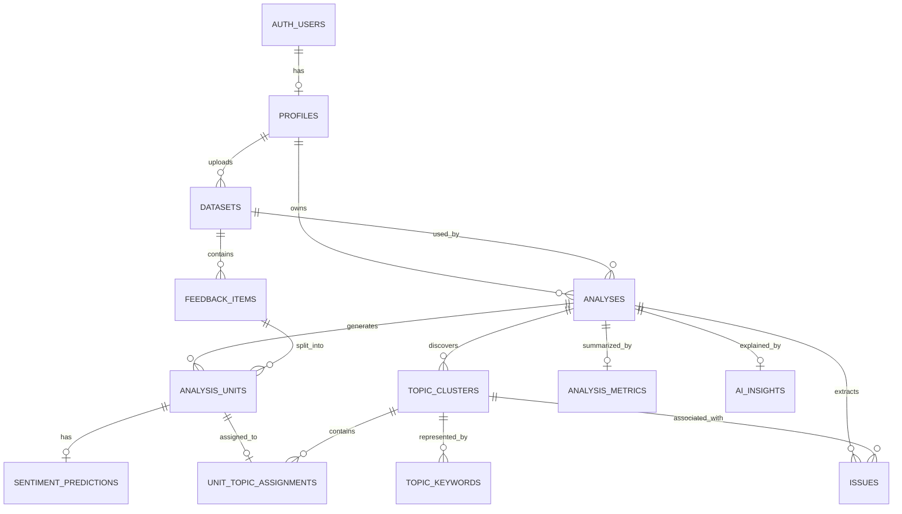

# SVARA AI Database Schema

**Document:** Database Schema  
**Product:** SVARA AI  
**Database:** PostgreSQL / Supabase  
**Version:** 1.0  
**Status:** Development Baseline  
**Last Updated:** 24 August 2026  

---

## 1. Database Design Goals

Database SVARA AI harus mendukung:

1. Authentication ownership berdasarkan Supabase Auth.
2. Penyimpanan metadata file tanpa membuat file public.
3. Analysis history.
4. Traceability dari dataset hingga hasil prediction.
5. Penyimpanan sentence atau clause sebagai unit analisis.
6. Sentiment prediction per unit.
7. Topic cluster dan keyword hasil BERTopic.
8. Topic assignment per unit.
9. Issue extraction.
10. Dashboard aggregate.
11. LLM Insight Summary.
12. Versioning model untuk reproducibility.

---

## 2. Entity Relationship Diagram



---

## 3. Table Overview

| Table | Purpose |
|---|---|
| `profiles` | Profile tambahan untuk Supabase Auth user |
| `datasets` | Metadata file CSV/XLSX |
| `analyses` | Analysis job dan configuration |
| `feedback_items` | Satu row feedback dari dataset |
| `analysis_units` | Sentence atau clause hasil segmentation |
| `sentiment_predictions` | Prediction sentiment per unit |
| `topic_clusters` | Topic/aspect cluster per analysis |
| `topic_keywords` | Keyword representatif cluster |
| `unit_topic_assignments` | Hubungan unit dengan cluster |
| `issues` | Issue atau phrase hasil extraction |
| `analysis_metrics` | Aggregate dashboard cache |
| `ai_insights` | LLM Insight Summary |

---

## 4. Enum Definitions

Recommended PostgreSQL enums:

```sql
create type analysis_status as enum (
  'pending',
  'processing',
  'completed',
  'failed'
);

create type sentiment_label as enum (
  'positive',
  'neutral',
  'negative'
);

create type insight_status as enum (
  'pending',
  'completed',
  'failed',
  'skipped'
);
```

Jika Supabase migration workflow lebih nyaman menggunakan `text`, enum dapat diganti dengan `text + check constraint`.

---

## 5. `profiles`

Supabase Auth menyimpan akun utama pada:

```text
auth.users
```

Aplikasi tidak menyimpan password pada tabel custom.

### Schema

```sql
create table public.profiles (
  id uuid primary key references auth.users(id) on delete cascade,
  display_name text,
  created_at timestamptz not null default now(),
  updated_at timestamptz not null default now()
);
```

### Notes

`id` sama dengan `auth.users.id`.

---

## 6. `datasets`

Menyimpan metadata file yang diupload.

Original file berada pada private object storage.

### Schema

```sql
create table public.datasets (
  id uuid primary key default gen_random_uuid(),
  user_id uuid not null references public.profiles(id) on delete cascade,

  original_filename text not null,
  storage_path text not null,
  file_type text not null check (file_type in ('csv', 'xlsx')),

  row_count integer,
  column_count integer,
  columns_json jsonb,

  file_size_bytes bigint,
  content_hash text,

  created_at timestamptz not null default now()
);
```

### Example

```json
{
  "original_filename": "review_agustus.csv",
  "storage_path": "user-id/dataset-id/review_agustus.csv",
  "file_type": "csv",
  "row_count": 5000,
  "column_count": 4,
  "columns_json": [
    "review",
    "date",
    "rating",
    "source"
  ]
}
```

---

## 7. `analyses`

Menyimpan satu analysis job.

### Schema

```sql
create table public.analyses (
  id uuid primary key default gen_random_uuid(),

  user_id uuid not null references public.profiles(id) on delete cascade,
  dataset_id uuid not null references public.datasets(id) on delete cascade,

  name text not null,

  feedback_column text not null,
  date_column text,

  status analysis_status not null default 'pending',
  current_stage text,
  progress smallint check (progress between 0 and 100),

  sentiment_model_name text,
  sentiment_model_version text,

  embedding_model_name text,
  topic_model_version text,
  preprocessing_version text,

  topic_config jsonb,

  error_message text,

  started_at timestamptz,
  completed_at timestamptz,

  created_at timestamptz not null default now(),
  updated_at timestamptz not null default now()
);
```

### Example `topic_config`

```json
{
  "min_topic_size": 15,
  "nr_topics": "auto",
  "top_n_words": 10,
  "language": "multilingual"
}
```

---

## 8. `feedback_items`

Menyimpan row feedback hasil parsing dataset.

### Schema

```sql
create table public.feedback_items (
  id uuid primary key default gen_random_uuid(),

  dataset_id uuid not null references public.datasets(id) on delete cascade,

  source_row_number integer not null,

  raw_text text,
  normalized_text text,

  feedback_date timestamptz,

  metadata jsonb,

  created_at timestamptz not null default now(),

  unique (dataset_id, source_row_number)
);
```

### `metadata`

Kolom non-feedback dapat disimpan sebagai JSONB jika dibutuhkan.

Example:

```json
{
  "rating": 2,
  "source": "mobile_app"
}
```

MVP tidak wajib menyimpan seluruh kolom tambahan apabila tidak digunakan.

---

## 9. `analysis_units`

Satu feedback dapat dipecah menjadi beberapa unit.

Example:

```text
Feedback:
"Aplikasinya bagus tetapi OTP sering gagal"

Unit 0:
"Aplikasinya bagus"

Unit 1:
"OTP sering gagal"
```

### Schema

```sql
create table public.analysis_units (
  id uuid primary key default gen_random_uuid(),

  analysis_id uuid not null references public.analyses(id) on delete cascade,
  feedback_item_id uuid not null references public.feedback_items(id) on delete cascade,

  unit_index integer not null,

  raw_text text not null,
  normalized_text text,

  created_at timestamptz not null default now(),

  unique (analysis_id, feedback_item_id, unit_index)
);
```

---

## 10. `sentiment_predictions`

Menyimpan prediction sentiment per analysis unit.

### Schema

```sql
create table public.sentiment_predictions (
  id uuid primary key default gen_random_uuid(),

  analysis_unit_id uuid not null unique
    references public.analysis_units(id) on delete cascade,

  label sentiment_label not null,
  confidence double precision not null
    check (confidence >= 0 and confidence <= 1),

  positive_probability double precision,
  neutral_probability double precision,
  negative_probability double precision,

  model_version text,

  created_at timestamptz not null default now()
);
```

### Example

```json
{
  "label": "negative",
  "confidence": 0.943,
  "positive_probability": 0.021,
  "neutral_probability": 0.036,
  "negative_probability": 0.943
}
```

---

## 11. `topic_clusters`

Menyimpan cluster hasil BERTopic.

Topic ID merupakan ID yang diberikan pipeline untuk analysis tertentu.

`topic_id = -1` dapat digunakan untuk outlier jika ingin menyimpan outlier sebagai cluster record. Alternatifnya, outlier dapat disimpan tanpa `topic_clusters` dan assignment memiliki null cluster.

Recommended MVP: simpan topic `-1` sebagai outlier agar traceability sederhana.

### Schema

```sql
create table public.topic_clusters (
  id uuid primary key default gen_random_uuid(),

  analysis_id uuid not null references public.analyses(id) on delete cascade,

  topic_id integer not null,

  display_label text,
  unit_count integer not null default 0,

  representative_texts jsonb,

  created_at timestamptz not null default now(),

  unique (analysis_id, topic_id)
);
```

### `display_label`

Dihasilkan dari top 3 keywords.

Example:

```text
OTP / Login / Verifikasi
```

Tidak menggunakan LLM.

---

## 12. `topic_keywords`

Menyimpan keyword representatif cluster.

### Schema

```sql
create table public.topic_keywords (
  id uuid primary key default gen_random_uuid(),

  topic_cluster_id uuid not null
    references public.topic_clusters(id) on delete cascade,

  keyword text not null,
  weight double precision,
  rank integer not null,

  created_at timestamptz not null default now(),

  unique (topic_cluster_id, rank)
);
```

### Example

| rank | keyword | weight |
|---:|---|---:|
| 1 | otp | 0.182 |
| 2 | login | 0.164 |
| 3 | verifikasi | 0.139 |

`display_label`:

```text
OTP / Login / Verifikasi
```

---

## 13. `unit_topic_assignments`

Menghubungkan analysis unit dengan topic cluster.

### Schema

```sql
create table public.unit_topic_assignments (
  id uuid primary key default gen_random_uuid(),

  analysis_unit_id uuid not null unique
    references public.analysis_units(id) on delete cascade,

  topic_cluster_id uuid
    references public.topic_clusters(id) on delete set null,

  topic_probability double precision,

  created_at timestamptz not null default now()
);
```

Jika probability tidak tersedia dari pipeline tertentu, field dapat `null`.

---

## 14. `issues`

Menyimpan hasil issue extraction.

### Schema

```sql
create table public.issues (
  id uuid primary key default gen_random_uuid(),

  analysis_id uuid not null
    references public.analyses(id) on delete cascade,

  topic_cluster_id uuid
    references public.topic_clusters(id) on delete cascade,

  issue_text text not null,

  frequency integer not null default 0,
  score double precision,

  dominant_sentiment sentiment_label,

  created_at timestamptz not null default now()
);
```

### Example

```text
issue_text: "otp tidak masuk"
frequency: 256
dominant_sentiment: negative
```

---

## 15. `analysis_metrics`

Menyimpan aggregate dashboard sebagai cache.

Tujuannya agar dashboard tidak perlu menghitung ulang ribuan prediction setiap load.

### Schema

```sql
create table public.analysis_metrics (
  id uuid primary key default gen_random_uuid(),

  analysis_id uuid not null unique
    references public.analyses(id) on delete cascade,

  total_feedback integer not null default 0,
  total_units integer not null default 0,

  positive_count integer not null default 0,
  neutral_count integer not null default 0,
  negative_count integer not null default 0,

  positive_percentage double precision not null default 0,
  neutral_percentage double precision not null default 0,
  negative_percentage double precision not null default 0,

  topic_metrics jsonb not null default '[]'::jsonb,
  trend_metrics jsonb not null default '[]'::jsonb,

  calculated_at timestamptz not null default now()
);
```

### Example `topic_metrics`

```json
[
  {
    "topic_id": 3,
    "label": "OTP / Login / Verifikasi",
    "unit_count": 730,
    "positive_percentage": 12,
    "neutral_percentage": 17,
    "negative_percentage": 71
  }
]
```

### Example `trend_metrics`

```json
[
  {
    "period": "2026-08-01",
    "positive": 50,
    "neutral": 20,
    "negative": 30
  },
  {
    "period": "2026-08-02",
    "positive": 45,
    "neutral": 18,
    "negative": 37
  }
]
```

---

## 16. `ai_insights`

Menyimpan hasil LLM Insight Summary.

LLM hanya membaca aggregate snapshot.

### Schema

```sql
create table public.ai_insights (
  id uuid primary key default gen_random_uuid(),

  analysis_id uuid not null unique
    references public.analyses(id) on delete cascade,

  status insight_status not null default 'pending',

  provider text,
  model_name text,
  prompt_version text,

  input_snapshot jsonb,
  summary text,

  error_message text,

  generated_at timestamptz,
  created_at timestamptz not null default now()
);
```

### Example `input_snapshot`

```json
{
  "total_feedback": 5000,
  "sentiment": {
    "positive": 52,
    "neutral": 17,
    "negative": 31
  },
  "top_topics": [
    {
      "label": "OTP / Login / Verifikasi",
      "negative_percentage": 71
    }
  ],
  "top_issues": [
    {
      "text": "otp tidak masuk",
      "frequency": 256
    }
  ]
}
```

Snapshot penting untuk audit:

```text
Insight ini dibuat berdasarkan angka apa?
```

---

## 17. Recommended Indexes

```sql
create index idx_datasets_user_id
  on public.datasets(user_id);

create index idx_datasets_created_at
  on public.datasets(created_at desc);

create index idx_analyses_user_id
  on public.analyses(user_id);

create index idx_analyses_dataset_id
  on public.analyses(dataset_id);

create index idx_analyses_status
  on public.analyses(status);

create index idx_analyses_created_at
  on public.analyses(created_at desc);

create index idx_feedback_items_dataset_id
  on public.feedback_items(dataset_id);

create index idx_feedback_items_feedback_date
  on public.feedback_items(feedback_date);

create index idx_analysis_units_analysis_id
  on public.analysis_units(analysis_id);

create index idx_analysis_units_feedback_item_id
  on public.analysis_units(feedback_item_id);

create index idx_sentiment_predictions_label
  on public.sentiment_predictions(label);

create index idx_topic_clusters_analysis_id
  on public.topic_clusters(analysis_id);

create index idx_topic_keywords_cluster
  on public.topic_keywords(topic_cluster_id);

create index idx_unit_topic_assignments_cluster
  on public.unit_topic_assignments(topic_cluster_id);

create index idx_issues_analysis_id
  on public.issues(analysis_id);

create index idx_issues_topic_cluster_id
  on public.issues(topic_cluster_id);

create index idx_issues_frequency
  on public.issues(frequency desc);
```

---

## 18. Complete Baseline DDL

```sql
create extension if not exists pgcrypto;

create type analysis_status as enum (
  'pending',
  'processing',
  'completed',
  'failed'
);

create type sentiment_label as enum (
  'positive',
  'neutral',
  'negative'
);

create type insight_status as enum (
  'pending',
  'completed',
  'failed',
  'skipped'
);

create table public.profiles (
  id uuid primary key references auth.users(id) on delete cascade,
  display_name text,
  created_at timestamptz not null default now(),
  updated_at timestamptz not null default now()
);

create table public.datasets (
  id uuid primary key default gen_random_uuid(),
  user_id uuid not null references public.profiles(id) on delete cascade,
  original_filename text not null,
  storage_path text not null,
  file_type text not null check (file_type in ('csv', 'xlsx')),
  row_count integer,
  column_count integer,
  columns_json jsonb,
  file_size_bytes bigint,
  content_hash text,
  created_at timestamptz not null default now()
);

create table public.analyses (
  id uuid primary key default gen_random_uuid(),
  user_id uuid not null references public.profiles(id) on delete cascade,
  dataset_id uuid not null references public.datasets(id) on delete cascade,
  name text not null,
  feedback_column text not null,
  date_column text,
  status analysis_status not null default 'pending',
  current_stage text,
  progress smallint check (progress between 0 and 100),
  sentiment_model_name text,
  sentiment_model_version text,
  embedding_model_name text,
  topic_model_version text,
  preprocessing_version text,
  topic_config jsonb,
  error_message text,
  started_at timestamptz,
  completed_at timestamptz,
  created_at timestamptz not null default now(),
  updated_at timestamptz not null default now()
);

create table public.feedback_items (
  id uuid primary key default gen_random_uuid(),
  dataset_id uuid not null references public.datasets(id) on delete cascade,
  source_row_number integer not null,
  raw_text text,
  normalized_text text,
  feedback_date timestamptz,
  metadata jsonb,
  created_at timestamptz not null default now(),
  unique (dataset_id, source_row_number)
);

create table public.analysis_units (
  id uuid primary key default gen_random_uuid(),
  analysis_id uuid not null references public.analyses(id) on delete cascade,
  feedback_item_id uuid not null references public.feedback_items(id) on delete cascade,
  unit_index integer not null,
  raw_text text not null,
  normalized_text text,
  created_at timestamptz not null default now(),
  unique (analysis_id, feedback_item_id, unit_index)
);

create table public.sentiment_predictions (
  id uuid primary key default gen_random_uuid(),
  analysis_unit_id uuid not null unique
    references public.analysis_units(id) on delete cascade,
  label sentiment_label not null,
  confidence double precision not null
    check (confidence >= 0 and confidence <= 1),
  positive_probability double precision,
  neutral_probability double precision,
  negative_probability double precision,
  model_version text,
  created_at timestamptz not null default now()
);

create table public.topic_clusters (
  id uuid primary key default gen_random_uuid(),
  analysis_id uuid not null references public.analyses(id) on delete cascade,
  topic_id integer not null,
  display_label text,
  unit_count integer not null default 0,
  representative_texts jsonb,
  created_at timestamptz not null default now(),
  unique (analysis_id, topic_id)
);

create table public.topic_keywords (
  id uuid primary key default gen_random_uuid(),
  topic_cluster_id uuid not null
    references public.topic_clusters(id) on delete cascade,
  keyword text not null,
  weight double precision,
  rank integer not null,
  created_at timestamptz not null default now(),
  unique (topic_cluster_id, rank)
);

create table public.unit_topic_assignments (
  id uuid primary key default gen_random_uuid(),
  analysis_unit_id uuid not null unique
    references public.analysis_units(id) on delete cascade,
  topic_cluster_id uuid
    references public.topic_clusters(id) on delete set null,
  topic_probability double precision,
  created_at timestamptz not null default now()
);

create table public.issues (
  id uuid primary key default gen_random_uuid(),
  analysis_id uuid not null
    references public.analyses(id) on delete cascade,
  topic_cluster_id uuid
    references public.topic_clusters(id) on delete cascade,
  issue_text text not null,
  frequency integer not null default 0,
  score double precision,
  dominant_sentiment sentiment_label,
  created_at timestamptz not null default now()
);

create table public.analysis_metrics (
  id uuid primary key default gen_random_uuid(),
  analysis_id uuid not null unique
    references public.analyses(id) on delete cascade,
  total_feedback integer not null default 0,
  total_units integer not null default 0,
  positive_count integer not null default 0,
  neutral_count integer not null default 0,
  negative_count integer not null default 0,
  positive_percentage double precision not null default 0,
  neutral_percentage double precision not null default 0,
  negative_percentage double precision not null default 0,
  topic_metrics jsonb not null default '[]'::jsonb,
  trend_metrics jsonb not null default '[]'::jsonb,
  calculated_at timestamptz not null default now()
);

create table public.ai_insights (
  id uuid primary key default gen_random_uuid(),
  analysis_id uuid not null unique
    references public.analyses(id) on delete cascade,
  status insight_status not null default 'pending',
  provider text,
  model_name text,
  prompt_version text,
  input_snapshot jsonb,
  summary text,
  error_message text,
  generated_at timestamptz,
  created_at timestamptz not null default now()
);
```

---

## 19. Row Level Security

Jika Supabase digunakan, aktifkan RLS.

### Example

```sql
alter table public.profiles enable row level security;
alter table public.datasets enable row level security;
alter table public.analyses enable row level security;
```

### Dataset Policy

```sql
create policy "Users can view own datasets"
on public.datasets
for select
using (auth.uid() = user_id);
```

### Analysis Policy

```sql
create policy "Users can view own analyses"
on public.analyses
for select
using (auth.uid() = user_id);
```

Untuk child table seperti `analysis_units`, access dapat dilakukan melalui backend service role pada MVP agar policy tidak menjadi terlalu kompleks.

Service role key hanya disimpan di backend.

---

## 20. Storage Convention

Private bucket:

```text
datasets
```

Suggested object path:

```text
{user_id}/{dataset_id}/{original_filename}
```

Example:

```text
a6c.../9f2.../review_agustus.csv
```

Bucket tidak public.

---

## 21. Data Lifecycle

### Upload

```text
File
↓
Private Storage
↓
datasets
```

### Parse

```text
datasets
↓
feedback_items
```

### Analyze

```text
feedback_items
↓
analysis_units
↓
sentiment_predictions
↓
topic assignments
↓
issues
↓
analysis_metrics
↓
ai_insights
```

---

## 22. Deletion Behavior

Jika dataset dihapus:

```text
dataset
↓ cascade
analyses
feedback_items
analysis_units
predictions
topics
issues
metrics
insights
```

Original object pada Supabase Storage harus dihapus melalui application service karena PostgreSQL cascade tidak otomatis menghapus object storage.

---

## 23. Data Volume Considerations

Jika satu dataset memiliki:

```text
10,000 feedback
```

dan rata-rata:

```text
1.5 unit per feedback
```

maka:

```text
15,000 analysis_units
15,000 sentiment_predictions
15,000 unit_topic_assignments
```

Masih realistis untuk PostgreSQL MVP.

Jika volume jauh lebih besar, strategi dapat dikembangkan menjadi:

- bulk insert,
- partitioning,
- separate analytics store,
- object-based result storage.

Tidak diperlukan untuk prototype.

---

## 24. Minimal Schema Alternative

Jika tim ingin mengurangi kompleksitas pada Week 1 sampai Week 5, tabel MVP paling minimal adalah:

```text
profiles
datasets
analyses
feedback_items
analysis_units
sentiment_predictions
topic_clusters
topic_keywords
unit_topic_assignments
analysis_metrics
ai_insights
```

`issues` dapat dihitung dan disimpan ke `analysis_metrics.topic_metrics` pada versi paling sederhana.

Namun baseline schema di dokumen ini direkomendasikan karena memisahkan data hasil analysis dengan jelas.

---

## 25. Database Ownership by Development Role

### Project Lead + AI/NLP Engineer

Berkaitan dengan:

- `sentiment_predictions`
- `topic_clusters`
- `topic_keywords`
- `unit_topic_assignments`

### Backend + Data Engineer

Owner implementasi:

- seluruh schema,
- migration,
- repositories,
- storage,
- aggregation.

### Frontend + UI/UX Developer

Tidak melakukan direct mutation ke core analysis tables.

Frontend menggunakan API contract.

### Integration + QA Engineer

Bertanggung jawab terhadap:

- seed data,
- test fixture,
- ownership test,
- database integration test.

---

## 26. Recommended Seed Scenario

Dataset:

```text
review,date
"aplikasinya bagus tetapi otp tidak masuk",2026-08-01
"loading sangat lambat dan sering crash",2026-08-02
"fiturnya lengkap dan mudah digunakan",2026-08-03
```

Expected analysis units:

```text
aplikasinya bagus
otp tidak masuk
loading sangat lambat dan sering crash
fiturnya lengkap dan mudah digunakan
```

Expected example topics:

```text
OTP / Login / Verifikasi
Loading / Lambat / Crash
Fitur / Menu / Fungsi
```

Database seed seperti ini dapat digunakan untuk frontend dan integration testing sebelum model AI final tersedia.
